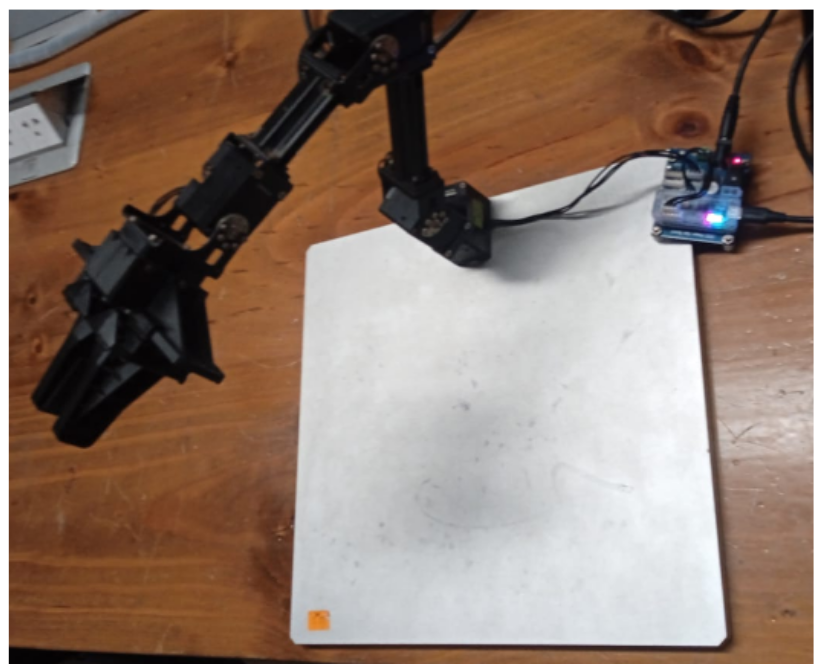
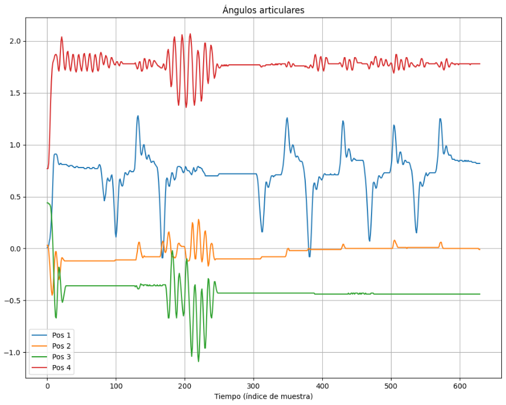

# 🦾 ROS2 OpenMANIPULATOR-X — Control por Compensación de Gravedad

> Control de torque con compensación de gravedad para el robot **OpenMANIPULATOR-X** usando **ROS 2 Jazzy** y servos Dynamixel.

---

## 📷 Robot en operación

<p align="center">
  
</p>

---

## 📊 Ángulos articulares durante el control

El siguiente gráfico muestra el comportamiento de los 4 joints del brazo robótico a lo largo del tiempo durante la ejecución del controlador de compensación de gravedad:

<p align="center">
  
</p>

Cada línea representa la posición angular (en radianes) de un joint en función del tiempo (índice de muestra):

| Joint | Color | Descripción |
|-------|-------|-------------|
| Pos 1 | 🔵 Azul | Articulación base — mayor variabilidad durante movimientos |
| Pos 2 | 🟠 Naranja | Articulación de hombro — oscila cerca de 0 rad |
| Pos 3 | 🟢 Verde | Articulación de codo — presenta oscilaciones fuertes al inicio |
| Pos 4 | 🔴 Rojo | Articulación de muñeca — estable cerca de 1.75 rad |

---

## 🗂️ Estructura del repositorio

```
ROS2-OPEN-MANIPULATOR-X-CONTROL/
├── DynamixelSDK/                   # SDK oficial de Dynamixel
├── dynamixel_hardware_interface/   # Interfaz de hardware ROS 2 para servos Dynamixel
├── dynamixel_interfaces/           # Mensajes e interfaces personalizadas
├── open_manipulator/               # Paquete principal con bringup y controladores
├── imgs/                           # Imágenes del robot y resultados
│   ├── robot_open_manipulator.png
│   └── datos_control.png
└── README.md
```

---

## ⚙️ Requisitos

- **ROS 2 Jazzy** (Ubuntu 24.04)
- **OpenMANIPULATOR-X** con servos Dynamixel XM430-W350
- Cable USB-Serial (U2D2 recomendado)
- DYNAMIXEL Wizard 2.0 (para configuración inicial)

---

## 🚀 Instalación y configuración

### 1. Clonar el repositorio

```bash
cd ~/ros2_ws/src
git clone https://github.com/josue99999/ROS2-OPEN-MANIPULATOR-X-CONTROL.git
```

### 2. Compilar el workspace

```bash
cd ~/ros2_ws
colcon build --symlink-install
source install/setup.bash
```

### 3. Configurar los servos Dynamixel

Usando **DYNAMIXEL Wizard 2.0**:
- Configurar todos los actuadores en modo **Current (Torque Control)**
- Velocidad de comunicación: **1 Mbps (1,000,000 bps)**

### 4. Verificar el puerto USB

```bash
ls /dev/ttyUSB*
```

Confirmar que el dispositivo es `/dev/ttyUSB0`.

### 5. Agregar permisos de puerto serial

```bash
sudo usermod -aG dialout $USER
```

> ⚠️ Cerrar sesión y volver a entrar para aplicar los cambios.

---

## ▶️ Ejecución

Lanzar el nodo de hardware con compensación de gravedad:

```bash
ros2 launch open_manipulator_bringup hardware_x.launch.py
```

---

## 🧠 Descripción del controlador

El controlador implementa **compensación de gravedad** en tiempo real para el OpenMANIPULATOR-X. Esto permite que el brazo mantenga su postura sin colapsar bajo su propio peso, aplicando el torque mínimo necesario calculado a partir del modelo dinámico del robot.

El torque de compensación se calcula como:

```
τ = G(q)
```

donde `G(q)` es el vector de torques gravitacionales en función de la configuración articular `q`.

---

## 📋 Notas

- El modo **Current Control** de Dynamixel permite enviar comandos de torque directamente.
- La compensación de gravedad se ejecuta en el nodo `dynamixel_hardware_interface` como parte del ciclo de control de `ros2_control`.
- Los ángulos graficados corresponden a una sesión de prueba con movimientos manuales del brazo mientras el controlador estaba activo.

---

## 🤝 Contribuciones

Las contribuciones son bienvenidas. Abre un *issue* o un *pull request* si tienes mejoras o correcciones.

---

## 📄 Licencia

Este proyecto es de uso académico. Consulta el archivo `LICENSE` para más detalles.
